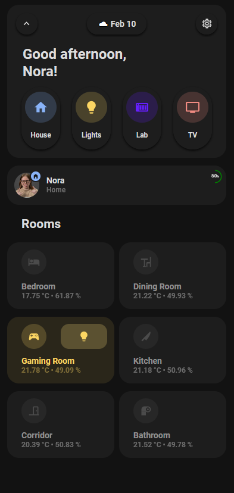
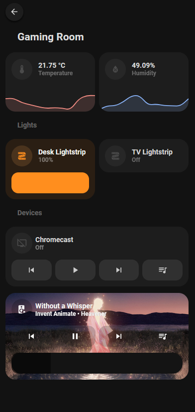
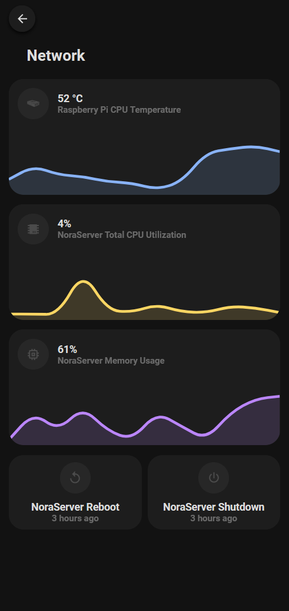
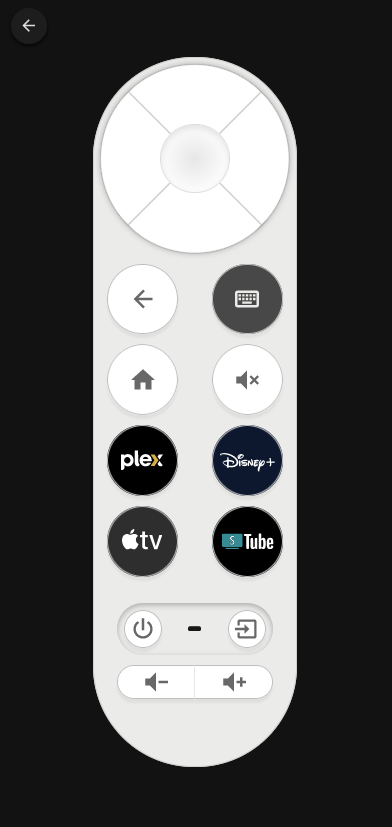

# Code Projects

In this page I present some of my coding projects

## My portfolio

My very first portfolio using React based on my favorite VS Code theme called Tokyo Night.

Used technologies:

&nbsp;

## My Home Assistant Dashboard (WIP)

&nbsp;

&nbsp;

This is my mobile dashboard in Home Assistant. I used mostly this cool theme [Minimalist UI](https://ui-lovelace-minimalist.github.io/UI/)

&nbsp;

## Instagram Clone school project

&nbsp;

&nbsp;

This project was part of a school project during my apprenticeship.

&nbsp;

Project link: [Instagram Ruby on Rails](https://github.com/Hiekkan/instagram_ruby_on_rails)
Used technologies:

&nbsp;

&nbsp;
