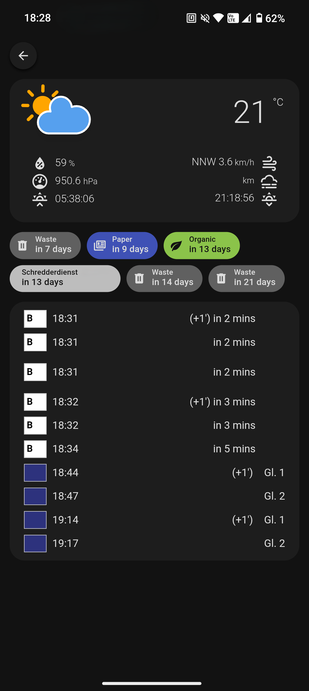

# Code Projects

Showcasing my coding projects

## Waste Collection Integration for Home Assistant

### 2024

My first open-source contribution to the [HACS Waste Collection Schedule](https://github.com/mampfes/hacs_waste_collection_schedule) custom component for Home Assistant. I added support for my local municipality waste provider.

&nbsp;

&nbsp;

**Key Features:**

- **Custom Integration:** Added support for my municipality waste collection service.
- **Open Source Workflow:** Worked with the project's structure, forked the repo, and submitted a pull request.
- **Configurable via YAML:** Enables Home Assistant users in my municipality to easily track upcoming waste pickups.

&nbsp;

**Technologies Used:**

&nbsp;

## My portfolio

### 2023

A personal portfolio project built with React, inspired by my favorite VS Code theme, Tokyo Night.

&nbsp;

**Key Features:**

- **VS Code Interface:** Mimics the Visual Studio Code experience for an interactive portfolio.
- **Theme Customization:** Switch between dark and light themes, perfect for those on the "light side".
- **Responsive:** Ensures a seamless experience across devices.

&nbsp;

**Technologies Used:**

&nbsp;

## Instagram Clone

### 2020

A school project completed during my apprenticeship, featuring an Instagram clone with key functionalities.

&nbsp;

**Key Features:**

- **Login Page:** Mimics Instagram’s authentication process.
- **Front Page:** Displays user feeds and posts.
- **Detail Post:** Shows individual post details with comments.

&nbsp;

**Technologies Used:**

&nbsp;

&nbsp;

**Project link:** [Instagram Clone](https://github.com/Hiekkan/instagram_ruby_on_rails)

&nbsp;

