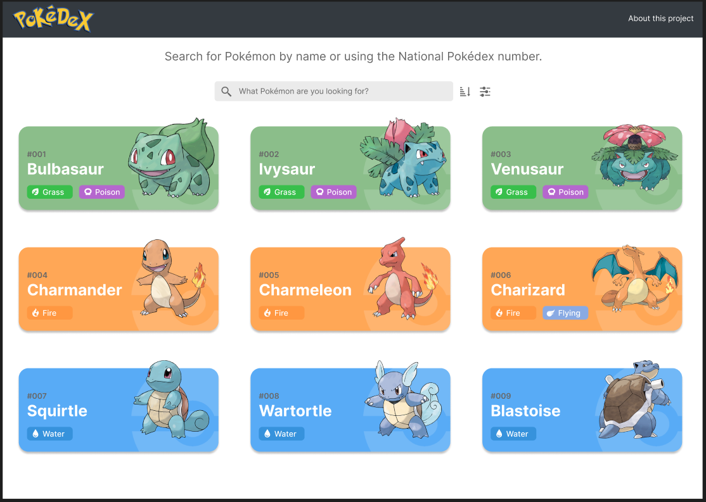
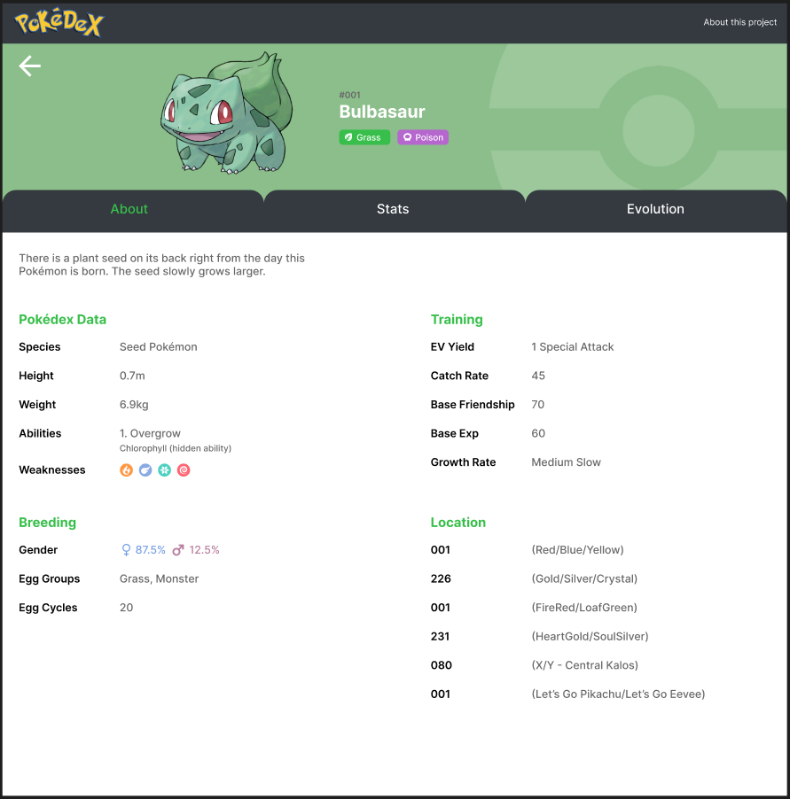
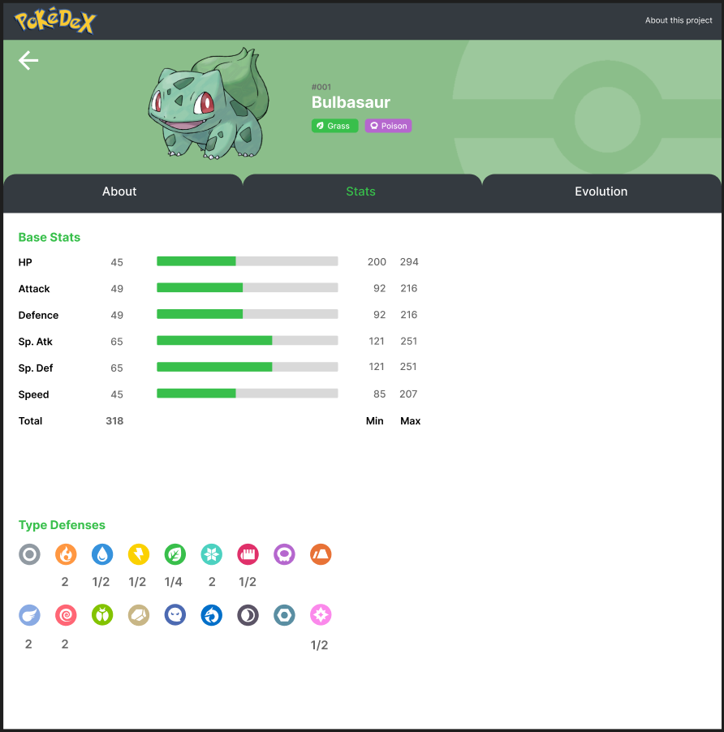
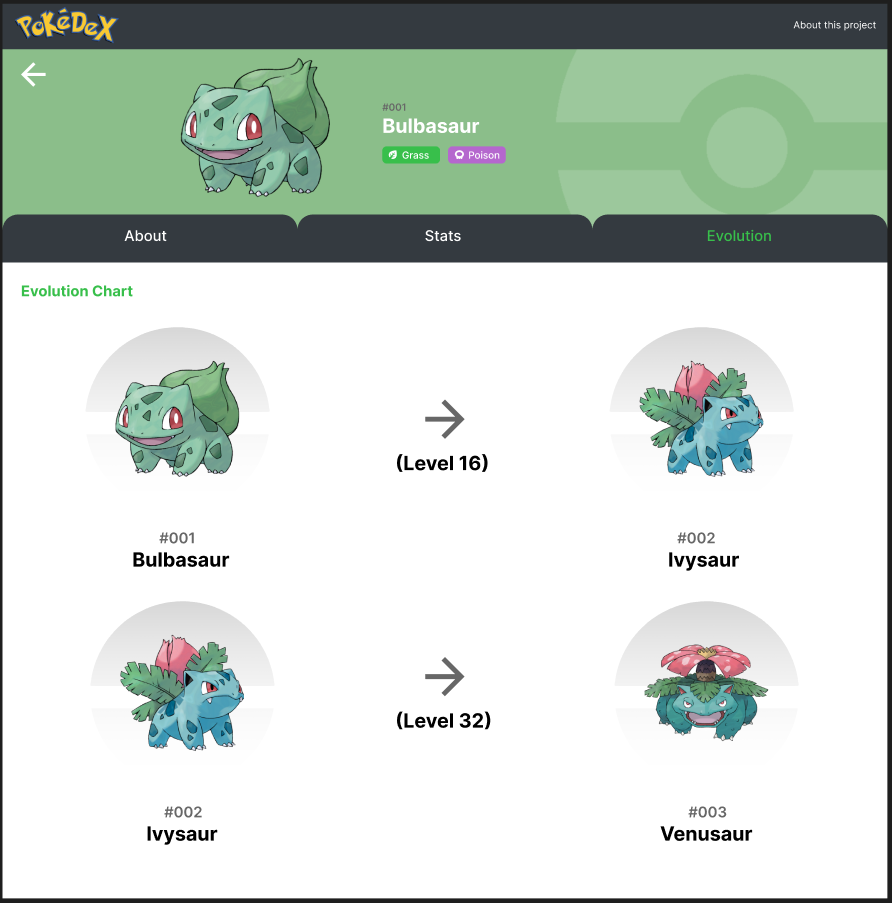

# Projects
In this page I present some of my projects

## Instagram Clone school project

&nbsp;

This project was part of a school project during my apprenticeship.

&nbsp;

Project link: [Instagram Ruby on Rails](https://github.com/Hiekkan/instagram_ruby_on_rails)
Used technologies:

&nbsp;

## Pokédex in Blazor (WIP)

&nbsp;

Currently work in progress. Started designing the frontend in figma and tested out the Pokémon REST API.

Link to figma: [Pokédex concept](https://www.figma.com/file/NtRUou7dHmWz5B1Y37ib1C/Pok%C3%A9dex?node-id=0%3A1&t=y8Otd3kvblpH7zyA-1)

Technologies I'm going to use:

&nbsp;

## My portfolio

My very first portfolio using React based on my favorite VS Code theme called Tokyo Night.

Used technologies:

&nbsp;

## First website in pure HTML & CSS

&nbsp;

&nbsp;

This is my very first website I developed during my first year in the apprenticeship.
At some point I will redo and improve this project.

Project link: [Muse Website](https://github.com/Hiekkan/Muse_website)
Used technologies:

&nbsp;

## Samsung Terminal watchface

&nbsp;

I designed this watchface also based on my favorite VS Code theme called Tokyo Night.

&nbsp;